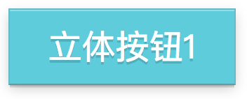
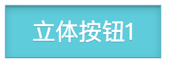
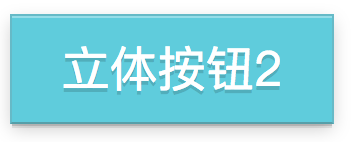
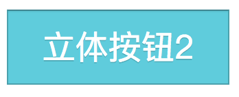

# 立体按钮
## 效果一
HTML
```html
 <div class="btn">立体按钮1</div>
```
CSS
```css
 .btn{
	background: #59ccde;
	padding:10px 0;
	margin-bottom:20px;
	width:160px;
	color:#fff;
	font-size:24px;
	text-align: center;
	border:1px solid rgba(128, 119, 119, 0.21);
	border-bottom-color:rgba(70, 72, 71, 0.34);
	text-shadow: 0 2px 0 rgba(0,0,0,0.15);
	box-shadow: 0 1px 0 rgba(255,255,255,0.34) inset,0 2px 0 -1px rgba(0,0,0,0.13),0 3px 0 -1px rgba(0,0,0,0.08),0 3px 13px -1px rgba(0,0,0,0.21);
}
.btn:active{
	text-shadow: 0 1px 0 rgba(0,0,0,0.15);
	box-shadow: 0 1px 0 rgba(255, 255, 255, 0.34), 0 2px 0 -1px rgba(0, 0, 0, 0.13) inset, 0 3px 0 -1px rgba(0, 0, 0, 0.08) inset, 0 3px 13px -1px rgba(0, 0, 0, 0.21) inset;
}
```
效果




## 效果二
HTML
```html
 <div class="btn2">立体按钮2</div>
```
CSS
```css
 .btn2{
	background: #59ccde;
	padding:10px 0;
	width:160px;
	color:#fff;
	font-size:24px;
	text-align: center;
	border:1px solid rgba(128, 119, 119, 0.21);
	border-bottom-color:rgba(70, 72, 71, 0.34);
	text-shadow: 0 2px 0 rgba(0,0,0,0.15);
	box-shadow: 0 1px 0 rgba(255,255,255,0.34) inset,0 2px 0 -1px rgba(0,0,0,0.13),0 3px 0 -1px rgba(0,0,0,0.08),0 3px 13px -1px rgba(0,0,0,0.21);
}
.btn2:active{
	position: relative;
	top: 1px;
	border-color: rgba(0, 0, 0, 0.34) rgba(0, 0, 0, 0.21) rgba(0, 0, 0, 0.21);
	text-shadow: 0 1px 0 rgba(0,0,0,0.15);
	box-shadow: 0 1px 0 rgba(255, 255, 255, 0.89), 0 1px rgba(0, 0, 0, 0.05) inset;
}
```
效果




<a class="btn btn-success" href="https://vanessamf.github.io/demos/solid-button/index.html" role="button" target="_blank">
<i class="fa fa-eye"></i> 在线查看
</a>

!>**联系我：**vanessamf@sina.com
